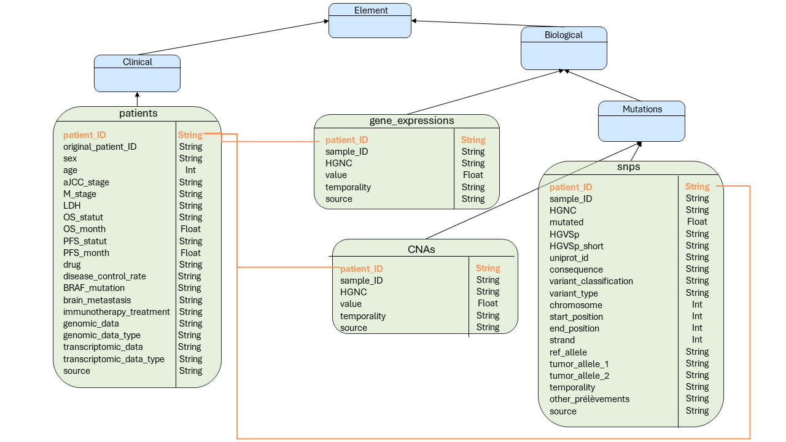

# MelanoDB
This repository is a tool to charge MelanoDB, a database collection of patients with metastatic melanoma treated with MAPK inhibitors. We formatted data from 8 different studies for a total of 420 cases to gather common clinical and molecular features. Whole or partial exome sequencing is available for 191 cases and gene expression for 132 cases. Web application to explore the database is available is this repository: . We whare this dataset to the scientific community according to FAIR principles <br />

MelanoDB created using python 3.9

### Dependencies:

```peewee``` version 3.13.3 <br />
```starlette``` version 0.13.4 <br />
```playhouse``` <br />
```numpy``` <br />
```ujson``` <br />

### Installation

#### Mac and Linux
Create a virtual environment in melano-py root and load required package:
```bash env.sh```

#### Windows

Create a virtual environment in melano-py root:
```python -m virtualenv .venv```

Activate the virtual environment:
```.\.venv\Scripts\activate```

Install required packages:
```pip -m install -r requirements.txt```

### Class diagram


## References
This database has been created using followed references:
<a id="1">[1]</a>  *Blateau, P., Coyaud, E., Laurent, E., Béganton, B., Ducros, V., Chauchard, G., Vendrell, J. A., & Solassol, J. (2020).* **TERT Promoter Mutation as an Independent Prognostic Marker for Poor Prognosis MAPK Inhibitors-Treated Melanoma.** Cancers, 12(8), 2224. https://doi.org/10.3390/cancers12082224

<a id="1">[2]</a> *Catalanotti, F., Cheng, D. T., Shoushtari, A. N., Johnson, D. B., Panageas, K. S., Momtaz, P., Higham, C., Won, H. H., Harding, J. J., Merghoub, T., Rosen, N., Sosman, J. A., Berger, M. F., Chapman, P. B., & Solit, D. B. (2017).* **PTEN Loss-of-Function Alterations Are Associated With Intrinsic Resistance to BRAF Inhibitors in Metastatic Melanoma.** JCO precision oncology, 1, PO.16.00054. https://doi.org/10.1200/PO.16.00054

<a id="1">[3]</a> *Van Allen, E. M., Wagle, N., Sucker, A., Treacy, D. J., Johannessen, C. M., Goetz, E. M., Place, C. S., Taylor-Weiner, A., Whittaker, S., Kryukov, G. V., Hodis, E., Rosenberg, M., McKenna, A., Cibulskis, K., Farlow, D., Zimmer, L., Hillen, U., Gutzmer, R., Goldinger, S. M., Ugurel, S., …*  Dermatologic Cooperative Oncology Group of Germany (DeCOG) (2014). **The genetic landscape of clinical resistance to RAF inhibition in metastatic melanoma.** Cancer discovery, 4(1), 94–109. https://doi.org/10.1158/2159-8290.CD-13-0617

<a id="1">[4]</a> *Yan, Y., Wongchenko, M. J., Robert, C., Larkin, J., Ascierto, P. A., Dréno, B., Maio, M., Garbe, C., Chapman, P. B., Sosman, J. A., Shi, Z., Koeppen, H., Hsu, J. J., Chang, I., Caro, I., Rooney, I., McArthur, G. A., & Ribas, A. (2019).* **Genomic Features of Exceptional Response in Vemurafenib ± Cobimetinib-treated Patients with BRAFV600-mutated Metastatic Melanoma.** Clinical cancer research : an official journal of the American Association for Cancer Research, 25(11), 3239–3246. https://doi.org/10.1158/1078-0432.CCR-18-0720

<a id="1">[5]</a> *Louveau, B., Jouenne, F., Reger de Moura, C., Sadoux, A., Baroudjian, B., Delyon, J., Herms, F., De Masson, A., Da Meda, L., Battistella, M., Dumaz, N., Lebbe, C., & Mourah, S. (2019).* **Baseline Genomic Features in BRAFV600-Mutated Metastatic Melanoma Patients Treated with BRAF Inhibitor + MEK Inhibitor in Routine Care.** Cancers, 11(8), 1203. https://doi.org/10.3390/cancers11081203

<a id="1">[6]</a> *Marin-Bejar, O., Rogiers, A., Dewaele, M., Femel, J., Karras, P., Pozniak, J., Bervoets, G., Van Raemdonck, N., Pedri, D., Swings, T., Demeulemeester, J., Borght, S. V., Lehnert, S., Bosisio, F., van den Oord, J. J., Bempt, I. V., Lambrechts, D., Voet, T., Bechter, O., Rizos, H., … Marine, J. C. (2021).* **Evolutionary predictability of genetic versus nongenetic resistance to anticancer drugs in melanoma.** Cancer cell, 39(8), 1135–1149.e8. https://doi.org/10.1016/j.ccell.2021.05.015